# GBDK Playground

It has 16 kB of RAM, man.

## Samples
| [Blank](blank)            | [Hello World](hello_world)      | [Small Sprite](small_sprite)     |
|:-------------------------:|:-------------------------------:|:--------------------------------:|
|[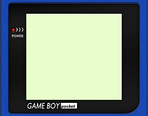](blank) |[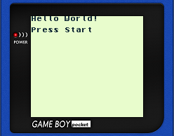]|[]|
| Minimum required code     | Print `Hello World!`            | Render small 8x8 sprite          |

| [Big Sprite](big_sprite)       | [Big Sprite Animation](big_sprite_animation) | [Input State](input_state)      |
|:------------------------------:|:--------------------------------------------:|:-------------------------------:|
|[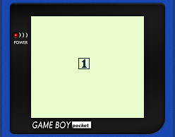]|[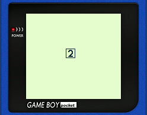]    |[]|
| Render big 16x16 sprite        | Animate big 16x16 sprite                     | Read joypad state               |

| [Input Wait](input_wait)       | [Move Sprite](move_sprite)      | [Background](background)        |
|:------------------------------:|:-------------------------------:|:-------------------------------:|
|[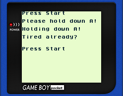]|[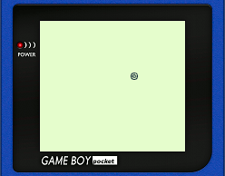]|[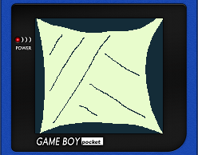] |
| Wait for button input          | Move a sprite using joypad      | Render a full-screen background |

| [Window](window)           | [Beep](beep)             | [Simple SHMUP](simple_shmup)     | 
|:--------------------------:|:------------------------:|:--------------------------------:|
|[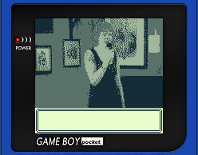]|[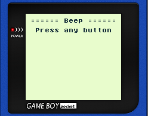]|[]| 
| Renders a window           | Make a sound             | Very simple SHMUP                | 

| [Huge Sprite](huge_sprite)      | [Drawing](drawing)              | [Detect GB Type](detect_gb)        |
|:-------------------------------:|:-------------------------------:|:----------------------------------:|
|[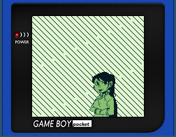]|[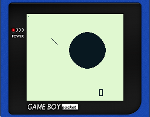]    |[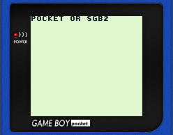]     |
| Renders a huge 40x64 sprite     | Built-in drawing functions      | Detect which GB is being used      |

| [Save RAM](save_ram)            | [Font](font)                    | [Link](link)                       |
|:-------------------------------:|:-------------------------------:|:----------------------------------:|
|[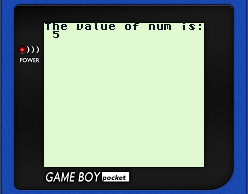]   |[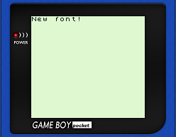]       |[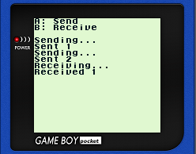]          |
| Save/load variables             | Load a new font                 | Send/Receive data using link cable |

| [Color](color)                  | More coming soon...                |
|:-------------------------------:|:----------------------------------:|
|[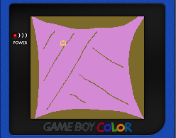]      |[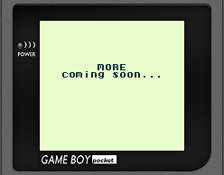]|
| Use palettes for Game Boy Color | Contributions are welcome!         |
