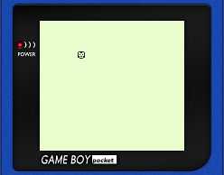
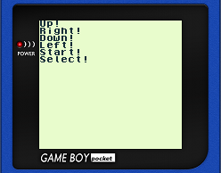

# GBDK Playground

It has 16 kB of RAM, man.

## Samples
| [Hello World](hello_world)      | [Small Sprite](small_sprite)     | [Big Sprite](big_sprite)       |
|:-------------------------------:|:--------------------------------:|:------------------------------:|
|  |  |  |
| Print `Hello World!`            | Render small 8x8 sprite          | Render big 16x16 sprite        |

| [Big Sprite Animation](big_sprite_animation) | [Input State](input_state)      | [Input Wait](input_wait)       |
|:--------------------------------------------:|:-------------------------------:|:------------------------------:|
|      |  |  |
| Animate big 16x16 sprite                     | Read joypad state               | Wait for button input          |

| [Move Sprite](move_sprite)      | [Background](background)        | [Window](window)           |
|:-------------------------------:|:-------------------------------:|:--------------------------:|
|  |   |  |
| Move a sprite using joypad      | Render a full-screen background | Renders a window           |

| [Beep](beep)             | [Simple SHMUP](simple_shmup)     | More coming soon...                  |
|:------------------------:|:--------------------------------:|:------------------------------------:|
|  |  |    |
| Make a sound             | Very simple SHMUP                | Contributions are welcome!           |
