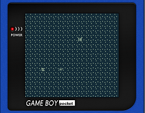

# Simple SHMUP

A simple side-scrolling shoot 'em up game. This example uses several small
sprites, a scrolling background and a full-screen image.

Tutorial: [How to write a simple side scrolling game in GBDK](https://pastebin.com/F3tHLj68) by Jason
